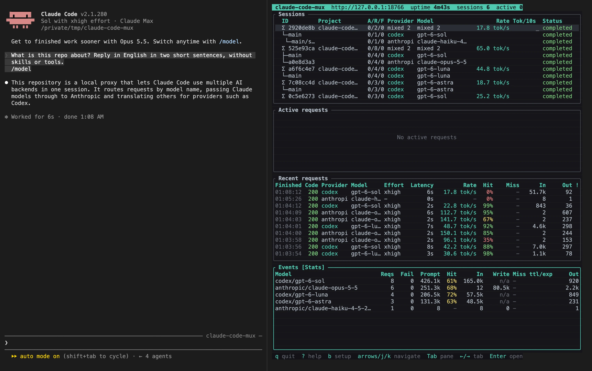
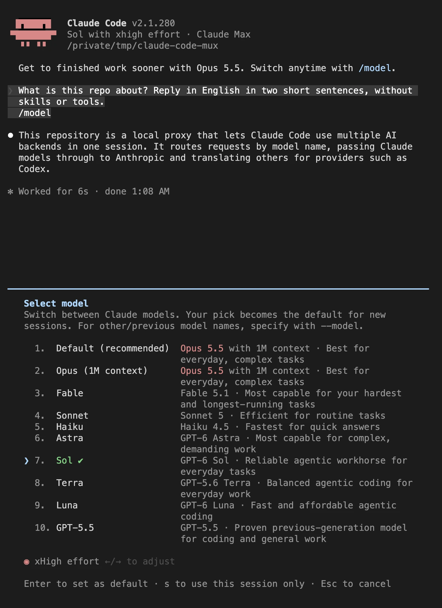
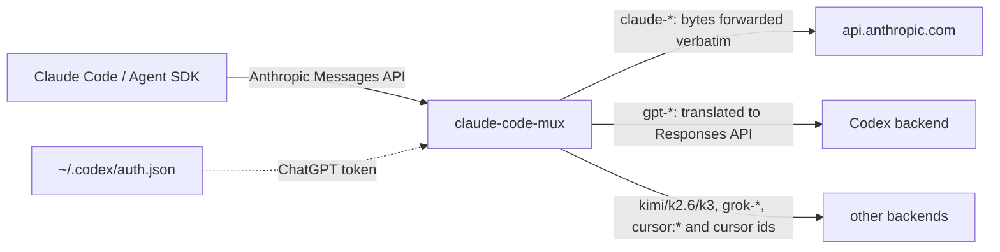

# claude-code-mux

[](https://github.com/null-topology/claude-code-mux/actions/workflows/ci.yml)

Run Claude Code on your **Claude subscription and your ChatGPT (Codex)
subscription at the same time**, and switch between them mid-conversation.

This is a fork of
[fcakyon/claude-code-with-codex](https://github.com/fcakyon/claude-code-with-codex),
itself a fork of
[raine/claude-code-proxy](https://github.com/raine/claude-code-proxy). See
[How this compares with the upstream projects](#how-this-compares-with-the-upstream-projects)
for what each layer contributed and what differs today.



<sub>The monitor in an earlier layout; the panes and columns have changed since
the screenshot was taken.</sub>

`claude-code-mux` is a small local proxy. Claude Code already speaks the Anthropic
Messages API, so the proxy speaks it too and sends each request where the model
name says:

- A **Claude** model goes to Anthropic untouched, on the login Claude Code
  already has. Nothing is translated, no API key is involved, and the proxy
  stores no Claude credentials.
- A **Codex** model (`gpt-6-astra`, `gpt-6-sol`, ...) is translated to the
  OpenAI Responses API and sent on the ChatGPT login of the Codex CLI.

So Opus can stay on your Claude plan for the hard parts while a Codex model
runs the everyday turns on your ChatGPT plan, in one session, with Claude
Code's own usage warnings and limit messages working for both.

[What it does](#what-it-does) · [Quickstart](#quickstart) ·
[Picking a model](#picking-a-model) · [How it works](#how-it-works) ·
[The monitor](#the-monitor) · [HTTP API](#http-api) ·
[Rate limits](#rate-limits) · [Configuration](#configuration) ·
[Other backends](#other-backends) · [Troubleshooting](#troubleshooting) ·
[Comparison](#how-this-compares-with-the-upstream-projects) ·
[Development](#development)

## What it does

- **Routes by model name, per request.** `claude-*` ids and the Claude aliases
  go to Anthropic, Codex ids to the ChatGPT backend, and Kimi, Grok and Cursor
  ids to their own translators. Nothing else decides the route.
  [Picking a model](#picking-a-model)
- **Relays the Claude route byte for byte**, on Claude Code's own subscription
  login, so Anthropic's prompt cache keeps working. [How it works](#how-it-works)
- **Translates Anthropic Messages to the OpenAI Responses API** for Codex, over
  a WebSocket by default, with reasoning that survives a switch between
  backends. [How it works](#how-it-works)
- **Lists the models your login can actually use.** `/v1/models` asks the Codex
  backend on every call instead of serving a list compiled into the binary.
  [Listing models](#listing-models)
- **Turns Codex quota into the rate-limit headers Claude Code reads**, so a
  Codex model shows the same usage warnings and limit messages as a Claude one.
  [Rate limits](#rate-limits)
- **Ships a terminal monitor** with per-session, per-conversation and per-model
  token accounting, cache hit and miss detection, and a conversation tree.
  [The monitor](#the-monitor)
- **Recognizes Claude Code's subagent progress label** and forwards it natively
  by default, so the client sees its real usage; it can also be answered from
  the transcript or pinned to a junior model.
  [Proxy side](#proxy-side)
- **Maps deferred tool loading onto Codex's native tool search**, so loading a
  tool mid-conversation does not rewrite the head of the prompt.
  [Claude Code side](#claude-code-side)
- **Keeps Codex models on the full Responses lane** so they can answer with
  several tool calls at once.
  [Responses lanes and parallel tool calls](#responses-lanes-and-parallel-tool-calls)
- **Gives each conversation its own prompt-cache scope** on the Codex backend, so
  a subagent does not share the main thread's cache key.
  [How it works](#how-it-works)
- **Optionally exposes OpenAI-compatible surfaces** — responses, chat
  completions, images, transcriptions — for clients that do not speak the
  Anthropic API. [HTTP API](#http-api)

## What this fork adds

Neither upstream project has these; the details and the evidence are in
[the comparison](#how-this-compares-with-the-upstream-projects).

- **Live Codex model discovery.** `/v1/models` and `claude-code-mux models` ask
  the Codex backend what the logged-in account may use, instead of printing a
  list compiled into the build.
- **A richer `/v1/models`.** Every row carries its `provider`, a top-level
  `providers[]` block says where each group's rows came from and whether the
  listing succeeded, and `?provider=` asks one backend and fails loudly.
- **Codex quota as `anthropic-ratelimit-unified-*` utilization headers** on
  every healthy response, so Claude Code's usage warning works on Codex models.
  The spent-window answer with `x-should-retry: false` started here as well and
  has since been merged into the original project.
- **One attempt per Codex request.** The proxy does not retry a failed Codex
  request, and an empty completion is an ordinary end of turn. The client,
  which has its own retry policy, decides; both upstreams retry a live stream
  and an empty completion up to ten times each.
- **Deferred tool loading on the Codex route**, mapped onto the backend's own
  tool search so the cached prompt prefix survives a tool load.
- **A switch for Claude Code's subagent progress label**: forwarded natively by
  default, answered from the transcript with `CCP_AGENT_SUMMARY=local`, or
  pinned to a junior model with `CCP_AGENT_SUMMARY=upstream`.
- **A per-conversation prompt-cache scope** on Codex: the session id for a main
  thread, a derived id for each subagent.
- **The monitor's token accounting** — the cache read and write split, evidence
  marks on every count, per-lane cache-miss detection, and the session
  conversation tree.
- **The Responses lane as configuration** (`CCP_CODEX_LANE_POLICY`), instead of
  a decision made only by a compiled-in table.

Inherited from the parent fork, so not unique to this one but still a difference
from the original: the Anthropic passthrough itself, Claude aliases defaulting
to Anthropic, and reading the Codex login from the Codex CLI.

## What you need

- **Claude Code** 2.1.261 or newer (for the `modelPicker` setting), signed in
  with a Claude Pro or Max plan.
- A **ChatGPT Plus, Pro, or Team** plan and the **Codex CLI** signed in
  (`codex login`).
- **Rust** only if you install from source. The prebuilt binary needs nothing.

## Quickstart

**1. Install `claude-code-mux`.**

The install script covers macOS and Linux:

```sh
curl -fsSL https://raw.githubusercontent.com/null-topology/claude-code-mux/main/scripts/install.sh | bash
```

`CLAUDE_CODE_MUX_VERSION=v0.7.0` pins a release and
`CLAUDE_CODE_MUX_INSTALL_DIR=/opt/bin` chooses where the binary lands (default
`/usr/local/bin`, else `~/.local/bin`). Releases also carry prebuilt binaries
for Windows on x86_64 and aarch64; the script refuses to run there, so download
the archive from the release page or build from source.

Or build from source with Rust:

```sh
cargo install --git https://github.com/null-topology/claude-code-mux --locked
```

**2. Check the Codex login.** The proxy reads the Codex CLI's own credentials
and has no login of its own.

```sh
claude-code-mux codex auth status
```

Run `codex login` if no valid account is found.

**3. Point Claude Code at the proxy** in `~/.claude/settings.json`:

```json
{
  "env": {
    "ANTHROPIC_BASE_URL": "http://127.0.0.1:18765"
  }
}
```

Do **not** set `ANTHROPIC_API_KEY` or `ANTHROPIC_AUTH_TOKEN`. See
[Claude authentication](#claude-authentication) for why.

**4. Start the proxy** and leave it running:

```sh
claude-code-mux serve
```

It listens on `127.0.0.1:18765` and opens the monitor when stdout is a
terminal. When stdout is a pipe or a service manager's log, it starts in plain
mode on its own and prints a short banner instead; `--no-monitor` forces plain
mode in a terminal too.

**5. Restart Claude Code** and pick a model:

```text
/model gpt-6-sol
/model claude-opus-5
```

## Picking a model

### Model ids

Codex models are addressed by their Codex id, for example `gpt-6-astra`,
`gpt-6-sol`, `gpt-6-luna`, `gpt-5.6-terra`, or `gpt-5.5`. The proxy does
not keep that list itself: `claude-code-mux models` and `GET /v1/models` ask
the Codex backend which models your ChatGPT login may use and print exactly
that, so a model Codex starts serving is available without a proxy release
(see [Listing models](#listing-models)).

Routing follows the same listing, and nothing has to call `/v1/models`
first. When `serve` starts it asks every backend it holds a login for which
models it serves, in the background, and a request for a model it does not
recognise makes it ask once more before it answers `Unknown model`. That
second ask runs at most once every 30 seconds, so a mistyped id does not
reach the backend on every request. Once a backend has answered, its list is
what routes: a model it stops listing stops routing, and until it has
answered, the list built into the proxy is used. An answer that names no
model at all is ignored, so the last good list keeps routing, and each list
the proxy takes over is noted in its log with how many models it names. The
backends asked this way are the ones that report a saved login; the
`models` command and `/v1/models` ask every backend regardless.

Two suffixes are understood on any id:

- `-fast` (for example `gpt-5.6-sol-fast`) requests Codex's priority service
  tier for that model.
- `[1m]` (for example `gpt-5.6-sol[1m]`) is Claude Code's large-context marker.
  The proxy strips it before routing and before talking to a backend. The
  monitor still records the id the client sent, suffix included.

Claude models keep their normal names. The bundled aliases are `opus`,
`sonnet`, `haiku`, `fable`, `claude-opus-5`, `claude-opus-4-8`,
`claude-opus-4-7`, `claude-sonnet-5`, `claude-sonnet-4-6`, `claude-haiku-4-5`
(and its dated id) and `claude-fable-5`; any other `claude-*` id routes the same
way. `claude-code-mux models` prints every id the proxy accepts.

Any of these works with `/model` inside Claude Code, with `--model` on the
command line, and with `ANTHROPIC_MODEL` to fix one model for a whole session.

### Rows in the `/model` picker

Claude Code's `/model` picker lists its built-in Claude models. Codex models
are not in that list, so out of the box you type their ids. To pick them by
arrow key like the built-in rows, add a `modelPicker` block to
`~/.claude/settings.json`:

```json
{
  "modelPicker": {
    "options": [
      {
        "model": "gpt-6-astra",
        "label": "Astra",
        "description": "GPT-6 Astra · Most capable for complex, demanding work",
        "behavesAs": "claude-opus-5"
      },
      {
        "model": "gpt-6-sol",
        "label": "Sol",
        "description": "GPT-6 Sol · Reliable agentic workhorse for everyday tasks",
        "behavesAs": "claude-sonnet-5"
      },
      {
        "model": "gpt-5.6-terra",
        "label": "Terra",
        "description": "GPT-5.6 Terra · Balanced agentic coding for everyday work",
        "behavesAs": "claude-sonnet-5"
      },
      {
        "model": "gpt-6-luna",
        "label": "Luna",
        "description": "GPT-6 Luna · Fast and affordable agentic coding",
        "behavesAs": "claude-sonnet-5"
      },
      {
        "model": "gpt-5.5",
        "label": "GPT-5.5",
        "description": "GPT-5.5 · Proven previous-generation model for coding and general work",
        "behavesAs": "claude-sonnet-5"
      }
    ]
  }
}
```

The rows appear after the built-in lineup:



Each field does one thing:

- `model` is sent to the proxy verbatim, so it must be an id the proxy accepts.
- `label` and `description` are only what the picker shows.
- `behavesAs` names a Claude model whose client-side defaults (prompt profile,
  context window, effort handling) Claude Code applies to the row. Without it
  Claude Code treats the model as unknown, assumes a 200k window, and prints a
  warning on every start. It does not change the label or the id sent. The
  row inherits that model's window, so a 1M model here (`claude-opus-5`,
  `claude-sonnet-5`) gives the row 1M, while `claude-haiku-4-5` caps it at
  200k. Behind the proxy that 1M only takes effect with
  `_CLAUDE_CODE_ASSUME_FIRST_PARTY_BASE_URL` set (see
  [Claude Code side](#claude-code-side)).

Do not put `[1m]` in a row's `model`: Claude Code 2.1.268 silently drops such
rows from the picker. The suffix still works on an id typed with `/model` or
passed to `--model`.

`modelPicker` is honored from user settings, managed settings, and the
`--settings` flag, not from a project checkout. Setting
`"replaceBuiltInOptions": true` next to `options` hides the built-in lineup and
shows only these rows.

### Why not gateway model discovery

Claude Code can also fetch `/v1/models` from a gateway
(`CLAUDE_CODE_ENABLE_GATEWAY_MODEL_DISCOVERY=1`), and the proxy serves that
endpoint. It is not the recommended path: discovery only runs when
`ANTHROPIC_AUTH_TOKEN`, an API key, or an `apiKeyHelper` is configured, and
any of those moves Claude Code off the subscription path, where the native
rate-limit events stop arriving for every model. `modelPicker` keeps the
subscription path intact.

### Listing models

`GET /v1/models` answers with what each backend can list right now, not with a
list compiled into the proxy. A backend the proxy holds a login for is asked
on every call; today that is Codex, whose backend has a metadata call that
returns the models the logged-in ChatGPT account may use. It spends no
completion quota and still answers while a usage window is spent, so the
listing is checkable under a rate limit.

Every row carries a `provider` field, and a top-level `providers` block says
where each group's rows came from:

```json
{
  "object": "list",
  "data": [
    {"type": "model", "object": "model", "id": "gpt-6-astra", "provider": "codex",
     "display_name": "…", "description": "…", "visibility": "list",
     "supported_in_api": true, "use_responses_lite": true,
     "context_window": 272000, "max_context_window": 872000,
     "default_reasoning_level": "medium",
     "supported_reasoning_levels": [{"effort": "low", "description": "…"}, …],
     "input_modalities": ["text", "image"]},
    {"type": "model", "object": "model", "id": "kimi-for-coding", "provider": "kimi",
     "display_name": "kimi-for-coding (kimi)"}
  ],
  "has_more": false, "first_id": "gpt-6-astra", "last_id": "…",
  "providers": [
    {"provider": "anthropic", "auth": "client", "source": "none", "status": "not_listed",
     "detail": "credentials are forwarded from the client; models are routed, not listed",
     "fetched_at": null},
    {"provider": "codex", "auth": "proxy", "source": "upstream", "status": "ok",
     "detail": null, "fetched_at": "2026-09-11T10:00:00Z"},
    {"provider": "kimi", "auth": "proxy", "source": "bundled", "status": "ok", …}
  ]
}
```

- `auth` is `proxy` when the proxy stores the login, `client` when the caller
  sends its own credential on every request (the Anthropic passthrough).
- `source` is `upstream` when the backend answered, `bundled` when the rows
  are a list compiled into this build and nothing was verified (kimi, grok,
  cursor), `none` when no rows are produced.
- `status` is `ok`, `unauthorized` (no login on this machine, or the backend
  refused it), `unreachable` (transport error, timeout, 5xx), or `not_listed`.

Codex rows are the backend's own entries, hidden models included; the fields
above are forwarded as the backend sent them, so a consumer decides what to
show. Anthropic is described but has no rows: the proxy holds no Anthropic
credential and Claude Code already lists its own models. No id in `data`
contains `claude` or `anthropic`, which is what keeps Claude Code's gateway
discovery from turning a marker into a picker row.

`GET /v1/models?provider=codex` asks one backend only. When that backend cannot
list, the request fails with 502 and the reason, so a consumer never mistakes
an empty answer for "no models". Without the filter the answer is always 200
and the failure is in the `providers` block. `?limit=N` truncates `data` and
sets `has_more`.

A model the backend listed routes to codex from then on, `-fast` variant
included, even if this build did not know it. That is why an id the compiled-in
catalog does not contain can still be accepted. The listing itself is never
cached: every call is a fresh answer from the backend, only the slugs it named
are remembered in memory for routing, and a restart forgets them along with
every other piece of conversation state (see [How it works](#how-it-works)).

The listing call requires a `client_version` query parameter. The proxy sends
the version recorded in the Codex CLI's `~/.codex/models_cache.json` when that
file exists next to `auth.json`, else a compiled-in default;
`CCP_CODEX_CLIENT_VERSION` (or `codex.clientVersion` in `config.json`)
overrides both.

## How it works



- **Routing** is by model name only. `claude-*` ids and the bundled Claude
  aliases go to Anthropic. Any other id must either match a backend's compiled-in
  list exactly — Kimi's `kimi-for-coding`, `kimi-k2.6`, `kimi-k3`, `k2.6`, `k3`;
  Grok's `grok-4.5`, `grok-composer-2.5-fast`; Cursor's `cursor:`, `cursor-plan:`
  and `cursor-ask:` prefixes plus its bare legacy ids — or be a slug the Codex
  backend named in its last successful listing. An id matching none of those
  returns a 400 that lists the accepted ids.
- **Session affinity never overrides a Claude-shaped id.** A session that has
  been running on Codex still sends `claude-opus-5` to Anthropic, which is what
  lets one slot stay on each plan in the same conversation.
- **The Claude route is a byte-exact passthrough.** The proxy forwards the
  request body and headers as received, including whatever authorization
  Claude Code attached, and streams the reply back. Because the bytes are
  unchanged, Anthropic's prompt caching keeps working. The one rewrite it
  performs is turning a signature-less `thinking` block into tagged text, and
  it only reserializes a request that has one.
- **The Codex route** maps the Messages API onto the Responses API over a
  WebSocket per conversation (`CCP_CODEX_TRANSPORT` picks `websocket`, `http`
  or `auto`) and reads the ChatGPT login from the Codex CLI's
  `~/.codex/auth.json`. When the token is refreshed it is written back so the
  Codex CLI keeps working. `previous_response_id` continuation state is kept
  per conversation as well, but it is off unless
  `CCP_CODEX_PREVIOUS_RESPONSE_ID` turns it on. Tool schemas lose their JSON
  Schema `pattern` keywords on the way, because OpenAI rejects some of the
  patterns Claude Code sends, such as Unicode property escapes; literal values
  and property names are kept.
- **Conversations come from Claude Code's headers.** The proxy reads
  `x-claude-code-session-id`, `x-claude-code-agent-id` and
  `x-claude-code-parent-agent-id`: the session plus the agent id identify a
  conversation, and the parent id only draws the tree. A request that sends no
  session header has no conversation and is accounted on its own.
- **Each conversation gets its own prompt-cache scope on Codex.** Claude Code
  gives a subagent its parent's session id, so the proxy sends the session id
  for a main thread and a derived id (a uuid v5 of session plus agent id) for a
  subagent, as both the request's `prompt_cache_key` and the `session_id`
  header. Without it every subagent would share the main thread's cache key and
  routing bucket.
- **Reasoning survives a switch.** A `thinking` block produced by one backend
  cannot be replayed to the other natively, so the proxy rewrites it as tagged
  text before sending the history on. Context is not lost when you move a
  conversation from one plan to the other.
- **All conversation state is in memory and process-local.** Sessions (30
  minutes idle before they are forgotten), provider affinity, continuation
  state, server-side compaction state, the WebSocket pool and the last model
  listing live in the running process. Restarting the proxy clears every one of
  them; nothing is written to disk to be reloaded.

## The monitor

`claude-code-mux serve` opens a terminal UI when stdout is a TTY.
`claude-code-mux demo` opens the same UI on simulated traffic with no server
listening, which is the way to look around without sending a request.

### Panes and key bindings

The screen holds four panes — **Sessions** (a tree: a `Σ` row per session with
its conversations under it), **Active requests**, **Recent requests** and a
bottom pane with two tabs, **Events** (the failed and 4xx/5xx requests out of
the recent list) and **Stats** (one row per backend and model since the proxy
started) — under a header bar showing the listen URL, uptime, and the session
and active-request counts. `Enter` on a Sessions or Recent row opens a detail
view for it.

Sessions are ordered by their latest request, newest first, whichever model or
conversation made it; a session with a request in flight sits above the idle
ones. The conversations under a session keep their tree order, and the
selected row stays selected when the order changes.

| key | what it does |
| --- | --- |
| `q` | ask to quit; `y` confirms, `n`, `q` or `Esc` cancels |
| `Ctrl-C` | begin shutdown at once, no confirmation; again while shutting down force-quits |
| `?` | toggle the shortcuts overlay |
| `b` | toggle the setup overlay |
| `Tab` | move focus Sessions → Recent → bottom pane → Sessions |
| `←` / `→` | focus the Sessions / Recent pane; in the bottom pane, switch between its Events and Stats tabs |
| `↑` / `↓`, `k` / `j` | move the selection within the focused pane; in the bottom pane, scroll its rows |
| `Enter` | open the detail view for the selected row |
| `Esc` | close the overlay, then the detail view |

The bottom pane's title names both tabs and brackets the one shown, as in
`[Events] Stats`.

The setup overlay (`b`) prints the log and config paths, how many models each
backend lists, and ready-to-paste `export` lines for a client. It is a
starting point, not the recommended dual-subscription setup: the token line it
prints is for a Codex-only client, and setting a token breaks the Claude route
(see [Claude authentication](#claude-authentication)).

Columns are dropped as the terminal narrows — the widest layout shows the
session sparkline and the request `Endpoint` and `Details` columns, and the
narrowest keeps little more than the time, status code, target and latency. A
column that disappeared is a width effect, not a missing value.

### Columns and marks

Sessions: `A/R/F` (active, total, failed requests), `Project`, `Provider`,
`Model`, `Effort`, `Ctx`, `Hit`, `Miss`, `In`, `Out`, `Rate` (output tokens per
second during generation), a tokens-per-10-seconds sparkline, and `Status`.
`Project` is derived from the working directory Claude Code states in its
system prompt.

Recent requests: `Finished`, `Code` (the HTTP status the client got),
`Project`, `Session`, `Provider`, `Model`, `Endpoint`, `Latency`, `Rate`,
`Hit`, `Miss`, `In`, `Out`, `Details`.

Stats: `Model` (backend and the model that ran, `provider/model`), `Reqs`,
`Fail`, `Prompt` (uncached input plus cache read plus cache write), `Hit`
(cache read over prompt), `In` (uncached input), `Write` (cache write; `n/a`
on a backend that never reports one, Codex among them), `Miss ttl/exp` (cache
misses judged within the cache lifetime / after it expired, with `+N?` for
misses whose lifetime was unknown), `Out`, `Lat(rec)` and `tok/s(rec)`. The
rows are summed over every session since the proxy started and sorted by
prompt tokens, biggest first. The two `(rec)` columns are medians over the
completed requests of that row still in the recent list, not over the whole
run, and an even number of requests gives the mean of the two middle values;
the other columns are lifetime sums.

Marks that carry meaning:

| mark | where | meaning |
| --- | --- | --- |
| `~` | any token cell | a provisional count; a final report has not replaced it yet |
| `n/a` | any token cell | nothing ever reported this count. Not a zero |
| `?<model>` | model cells | the request was only routed to that model; no upstream request was built |
| `local answer` | model cells | the proxy answered without calling a backend |
| `Σ` | Sessions | the session as a whole, above its conversations |
| `main thread` | Sessions | the session's own conversation, the one with no agent id |
| `^` | Sessions | a conversation whose named parent this session never saw |
| `/side` | conversation labels | a side call: a request carrying no client tool with an `input_schema` (session titles, the auto-mode classifier, the isolated web-search call) |
| `mixed N` | Sessions | the session ran N different backends or models, rather than the last one |
| `[Events]`, `[Stats]` | bottom pane title | the tab the pane is showing |
| `(rec)` | Stats headers | a median over the recent-request window, not a lifetime figure |
| `no tokens counted` | detail views | the row was never metered at all, which is not the same as four counts nobody reported |
| `(selection reset)` | pane titles | the selected row is gone; selection follows the row, not its position |

### What the monitor counts

Every count carries how well it is known. The four counts a request costs —
uncached input, cache read, cache write, output — are each `missing` until
something reports them, `opening` while they hold a provisional value, and
`exact` once a final report closes them. The Codex translator estimates the
whole prompt on a stream's first event, so its input starts as `opening` and
the backend's own count replaces it at the end. A zero a final report carries
is exact, and a count nobody reported is missing rather than zero: Codex
reports no cache writes, so that count stays missing on Codex. A request
finishing, well or badly, closes nothing; only a report does.

A request that already answered with HTTP 200 can still be recorded as
`failed`. An Anthropic Messages stream ends with `message_stop`, so a relayed
or translated stream that ends with an `error` event, or simply stops before
its terminal event, is recorded as failed with that reason. The status stays
the one the client received — the headers left long before the body did — and
the first failure observed wins, so a connection breaking after an error was
already named keeps the named reason.

Totals outlive the request list. The monitor keeps the last two hundred
requests in full and one small numeric record per request behind them, so
session, conversation and model figures stay right when counts arrive late,
which the live Codex path needs: it hands the response to the client before the
stream ends. Those records hold numbers and a little metadata, never prompts or
bodies, and they live until the proxy restarts, so their memory grows with the
number of requests served.

Per-model figures are keyed by backend and by the model that actually ran. The
id the client asked for is recorded as its request named it, `[1m]` suffix
included, before the summary, classifier and alias rewrites. The model a
provider put on the wire is recorded only when a real upstream request was
prepared, and that one decides which rollup the tokens land on, alongside a
count of the ids that asked for it. A model named there means the request was
prepared, not that the backend answered. Requests the proxy answers itself name
none, because none ran: the local `count_tokens` estimates, an agent summary
answered from the transcript (with `CCP_AGENT_SUMMARY=local`), Cursor's tool
bridge. The Claude route's
`count_tokens` is a real relay and does name one. Requests that belong to no
conversation get a rollup of their own rather than being left as the difference
between the others.

One kind of number is kept beside those four instead of folded into them. When
a backend reports the whole prompt without saying how much of it came from
cache, that total is kept as the prompt size and not as a fifth cost.
Anthropic's five-minute and one-hour cache-creation buckets are a breakdown of
the cache write rather than tokens beside it: they are held apart only as
evidence and remain part of the write total. Neither is inferred from the write
it is part of, from the other bucket or from the lifetime the response named.
A response can report them at a different moment than the write, so they need
not add up to it.

`count_tokens` requests count a prompt the real request counts again, and a
request the proxy answered itself never reached a model. Both are shown per
request, with their own numbers and request counts, and both stay out of the
token totals.

The monitor shows all of this rather than only recording it. A request row
names the model that ran; a model the request only asked for or was routed to
is prefixed `?`, and a request the proxy answered itself reads `local answer`
in place of a model, with counts the proxy measured itself rather than
estimated. Token cells carry their own evidence: `~` in front of a provisional
count, `n/a` where nothing was ever reported. The request detail spells out
`requested … · executed …`, states what those two marks mean, and lists the
cache write's five-minute and one-hour buckets as parts reported separately
rather than as a split of the write.

The Sessions pane leads each session with a `Σ` row for the session as a whole.
The conversations under it are those same requests grouped another way, never
parts to add up to that row; the session's own thread is named `main thread`,
and a conversation whose named parent the session never saw hangs at the top
level behind a `^`. Where a session ran more than one backend or more than one
model, those cells read `mixed` and the count instead of naming the last one.
The session detail lists one `models` line per backend and model that ran — the
ids that asked for it as `asked: …`, the four counts with their marks, requests
and errors — an `unattributed` line for the requests belonging to no
conversation, and an `evidence` line counting, for each of the four categories,
how many requests reported it exactly, held only an estimate, or never reported
it at all. A row nothing was ever metered for reads `no tokens counted` in place
of those four counts, which is not the same as four counts nobody reported. In
the `asked: …` list a caller that named no model at all is counted as `unnamed`.
Selection follows the row rather than its position, and a pane whose selected
row is gone says `(selection reset)` in its title.

### Prompt cache

Both backends cache the growing prefix of a conversation, and a cached token
costs a fraction of a fresh one. The monitor shows how much of each prompt came
from the cache and when it did not, for Claude models (read from the relayed
response without changing it) and for Codex models.

- **In** is the part of the prompt the backend processed at full price, as
  Anthropic reports `input_tokens`. Cache reads and cache writes are counted
  separately; the prompt size is the sum of the three, unless the backend
  reported a full prompt total of its own, which takes precedence over the sum.
- **Hit** is the share of the prompt served from the cache.
- **Ctx** is the prompt size of the session's latest main-conversation request,
  with the peak in the session detail. Every request re-reads the whole
  context, so a large context is paid for on every turn even when fully
  cached, and a cache miss on it reprocesses all of it. The session detail
  also shows how long that context's cache should stay warm.
- **Miss** counts the requests whose cache read fell short of what the
  previous request of the same conversation and model left behind, with the
  tokens that were processed again. See below for what counts.

A request is compared with the previous request of its conversation on the
same model. The expected cached prefix is the smaller of the two prompts, and
a shortfall counts as a miss once it reaches a tenth of that prefix, with a
floor of 1024 tokens and a ceiling of 20k. Some requests are not compared:

- Subagents have their own conversations.
- Requests without client tools are side calls: session titles, the auto-mode
  classifier, Claude Code's isolated web search call. They do not extend the
  transcript, so they are counted but not compared.
- A prompt that shrank by more than 1024 tokens was rewritten by the client,
  for example by compaction. It starts a new baseline.
- A request sent before the previous response began could not read that
  response's cache.
- A Claude conversation that has never read or written cache is below the
  model's minimum cacheable length.

Each miss is labeled with the time since the previous request of its
conversation:

- `expired`: the gap exceeded the cache lifetime. Claude Code writes Claude
  caches with a one-hour lifetime, and the monitor takes the lifetime from the
  response. Codex prefixes are documented to live at least 30 minutes after
  their last use.
- `within ttl`: the prefix should still have been alive. On Claude this means
  the prompt changed. On Codex it can also be the backend serving the request
  from a machine without the cache, so a single miss inside the documented
  lifetime is not proof the prompt changed.

Switching a conversation to another model is not labeled as a miss. The new
model starts its own cache, so its first request processes the whole context.

## HTTP API

The proxy speaks the Anthropic Messages API. These routes are always served:

| route | what it does |
| --- | --- |
| `GET /healthz` | Liveness check. Answers `{"ok": true}` with 200 and touches no backend. |
| `POST /v1/messages` | The Messages API, streaming and non-streaming. The `model` field decides the backend. |
| `POST /v1/messages/count_tokens` | Token count for a prompt. On the Claude route this is a real relay to Anthropic; on every other backend it is a local estimate and no upstream call is made. |
| `GET /v1/models` | The model listing described in [Listing models](#listing-models). Takes `?provider=<name>` and `?limit=N`. |

Three OpenAI-compatible surfaces are off by default and each needs its own
switch. They route by model id the same way the Anthropic routes do, so a Kimi,
Grok or Cursor id works on them too:

| route | switch |
| --- | --- |
| `POST /v1/responses`, `POST /v1/chat/completions` | `CCP_CODEX_RESPONSES_API=1` |
| `POST /v1/images/generations`, `POST /v1/images/edits` | `CCP_CODEX_IMAGES_API=1` |
| `POST /v1/audio/transcriptions` | `CCP_CODEX_TRANSCRIPTIONS_API=1` |

Any other path answers 404 with an Anthropic-shaped `not_found` error.

**Request body limits.** The Anthropic routes accept up to 64 MiB and answer a
larger body with 413 and an Anthropic-shaped `request_too_large` error. The
OpenAI-compatible responses and chat-completions routes accept up to 16 MiB and
answer 413 with the OpenAI error shape (`error.code: "request_too_large"`).
Image generation is capped at 256 KiB of JSON, image edits at 64 MiB (at most 5
images, 20 MiB each and 50 MiB combined), and a transcription at 25 MiB of
audio plus 1 MiB of form fields.

**Headers the proxy reads.** `x-claude-code-session-id` names the session,
`x-claude-code-agent-id` a subagent within it, and
`x-claude-code-parent-agent-id` that subagent's parent. The first two form the
conversation identity that continuation state, the prompt-cache scope and the
monitor's grouping are keyed on; the third only draws the tree and can never
move a request to another conversation. Each value must be a single header, at
most 512 characters, printable ASCII with no comma; anything else makes the
request conversationless rather than mis-grouped. Everything else on the Claude
route, authorization included, is forwarded untouched.

**Headers the proxy emits.** Every Messages response, `count_tokens` included,
carries `request-id`: the proxy's own id for the request, unless the backend
already sent one, which is how the Claude route relays Anthropic's. Claude Code
records it in the transcript as `requestId`, and tools that de-duplicate
transcripts key on it. Codex responses also carry the
`anthropic-ratelimit-unified-*` family described in
[Rate limits](#rate-limits), and a spent window also carries
`x-should-retry: false`.

## Rate limits

Codex reports its quota inside the stream, and the proxy translates it into the
`anthropic-ratelimit-unified-*` headers Claude Code already reads. The effect
is that Codex models behave like a Claude subscription:

- **Healthy window.** The 5-hour and 7-day utilization arrive on every
  response, as `-5h-utilization` / `-5h-reset` and the `-7d-*` pair, with
  `-surpassed-threshold` once a window is past its warning threshold. Claude
  Code's usage warning works, and an SDK caller receives a `RateLimitEvent`
  with `status='allowed'` or `'allowed_warning'` and the utilization figures.
- **Spent window.** Codex refuses with `usage_limit_reached` and a reset time.
  The proxy answers once, without retrying, with `status='rejected'` and the
  reset time. Claude Code shows its own
  "You've hit your session limit · resets 1:07pm" message and an SDK caller
  gets `RateLimitEvent` with `resets_at`. Before this the proxy burned every
  retry first and the client saw a bare 429 minutes later.

`Retry-After` is deliberately not sent: clients sleep for its full value, and
here that value is hours.

A reading whose reset time has already passed is dropped rather than published.
Both Codex transports behave the same way. On HTTP the live stream also reads
the window length and the reset clock from the response headers when the limit
event itself does not carry them. A 429 on the WebSocket handshake is the one
exception: it reaches the client as a plain 429.

## Configuration

### Claude Code side

Only `ANTHROPIC_BASE_URL` is required. Restart Claude Code after changing it.

| Variable | What it does |
| --- | --- |
| `ANTHROPIC_BASE_URL` | Point Claude Code at the proxy, e.g. `http://127.0.0.1:18765`. |
| `ANTHROPIC_MODEL` | Force one model for the whole session. |
| `ANTHROPIC_DEFAULT_OPUS_MODEL`, `..._SONNET_MODEL`, `..._HAIKU_MODEL`, `..._FABLE_MODEL` | Remap a built-in picker row, e.g. `ANTHROPIC_DEFAULT_SONNET_MODEL=gpt-5.6-terra` sends the Sonnet slot to Codex. The remap replaces the id for the whole slot, not for one call. |
| `CLAUDE_CODE_OAUTH_TOKEN` | Claude login for environments without an interactive `claude login`. Passed through to Anthropic unchanged. |
| `ENABLE_TOOL_SEARCH` | Claude Code disables lazy tool loading behind a non-Anthropic base URL. Set to `true`: requests shrink considerably. Claude models get the tool references untouched; on Codex models loading a tool uses the backend's own tool search, so the cached prompt prefix survives the load. |
| `_CLAUDE_CODE_ASSUME_FIRST_PARTY_BASE_URL` | Behind a non-Anthropic base URL Claude Code budgets every model at 200k tokens, even the ones its catalog marks as native 1M, and auto-compacts against that. Set to `1`: the passthrough is byte-exact, so the built-in rows keep their 1M window through the proxy, and `modelPicker` rows get the window of their `behavesAs` model. |

Context window: Claude Code computes it on the client, per model id. Measured
with `claude -p --model <id> "/context"` through the proxy on Claude Code
2.1.268:

| model | without the flag | with the flag |
| --- | --- | --- |
| `fable`, `sonnet` | 200k | 1M |
| `opus[1m]` | 1M | 1M |
| `haiku` | 200k | 200k |
| Codex row with `behavesAs` `claude-opus-5` or `claude-sonnet-5` | 200k | 1M |
| Codex row with `behavesAs` `claude-haiku-4-5` | 200k | 200k |

This is the budget Claude Code uses before auto-compacting, not proof of what
a backend endpoint accepts. The Codex inventory in `/v1/models` exposes
`context_window` and `max_context_window` metadata per model, but whether a
particular request is accepted has to be verified for its model and route. An
upstream context-overflow error is surfaced to the client; any recovery
depends on the configured client and proxy compaction behavior.

### Which backend runs which slot

The proxy routes on the model id in the request and on nothing else. It does
not detect which subscriptions you hold, does not inspect the credentials the
client sends, runs no probe to decide a route, and does not fall back to
another backend after an authentication failure. There is no provider
selector, no launcher and no profile generator: what each slot sends is
configured on the client side, and three setups cover the usual cases.

**Claude only.** Nothing beyond `ANTHROPIC_BASE_URL`. The Claude route is a
passive relay: the proxy stores no Anthropic credential and forwards the login
Claude Code attaches (see [Claude authentication](#claude-authentication)).

**Codex only, with no Claude login, API key or OAuth token.** Claude Code still
shows its built-in rows, so point those rows at Codex ids with the client's own
`ANTHROPIC_DEFAULT_*_MODEL` variables from the table above — for instance the
Haiku slot at `gpt-6-luna`, Sonnet at `gpt-5.6-terra`, Opus at `gpt-6-sol`
and Fable at `gpt-6-astra`. That assignment is an example of mapping by role,
not a recommendation: check what your login actually lists
(`claude-code-mux models`) before copying it, and check the variable names
against the Claude Code you run. `..._FABLE_MODEL` was read out of the CLI
binary (2.1.269, still present in 2.1.270). This setup has not been exercised
live against a client without Claude credentials. A request that still names a
`claude-*` id keeps going to Anthropic: the proxy relays whatever Anthropic
answers an unauthenticated call, unchanged, rather than quietly substituting
another model.

**Claude plus other backends.** Add [`modelPicker`
rows](#rows-in-the-model-picker), or type the real ids, and remap only the
slots you want moved — a partial remap is fine, and the two mechanisms mix.
`CCP_ALIAS_PROVIDER=codex` also exists and sends the Claude aliases plus every
`claude-*` id to Codex; it is kept for compatibility and is not the recipe to
reach for, because it changes what the Claude names mean for the whole proxy.

A slot remap moves everything that uses that slot. The proxy's own narrow
override is `CCP_AUTO_REVIEW_MODEL`, which reroutes Claude Code's background
security classifier — a non-streaming, tool-free request — and nothing else.
Left unset, that reroute happens only when the classifier would have gone to
Codex anyway; set explicitly, it applies on any route, the Anthropic one
included.

### Claude authentication

The Claude route relies on Claude Code sending its subscription login. That
only happens when no explicit key is configured:

| set on the client | Claude route | rate-limit events |
| --- | --- | --- |
| nothing, or `CLAUDE_CODE_OAUTH_TOKEN` | works on the subscription | delivered for Claude and Codex |
| `ANTHROPIC_API_KEY` | 401 unless the key is a real API key, then API billing | not delivered |
| `ANTHROPIC_AUTH_TOKEN` | works if it holds the OAuth token | not delivered, claude.ai connectors disabled |

The proxy never inspects or replaces the authorization it receives on the
Claude route.

### Proxy side

Settings are read from `CCP_*` environment variables first, then from
`config.json` in the config directory, then defaults. An environment value the
grammar does not accept is skipped rather than obeyed. The startup config
summary lists what was overridden: an environment setting is named by its
variable and source only, never with the value it carried, while a value read
from `config.json` is mostly printed as it stands.

This is the complete list of variables the proxy reads.

**Server and routing**

| Variable | Default | What it does |
| --- | --- | --- |
| `PORT` | `18765` | Listening port. `claude-code-mux serve --port N` overrides it. |
| `CCP_BIND_ADDRESS` | `127.0.0.1` | Listening address. |
| `CCP_CONFIG_DIR` | per platform | Move the config directory. It does **not** move the state directory. |
| `CCP_ALIAS_PROVIDER` | `anthropic` | Backend for the Claude aliases: `anthropic`, `codex` or `kimi`. Leave it alone unless you want `opus` to stop meaning Claude. |
| `CCP_AUTO_REVIEW_MODEL` | unset | Model for Claude Code's background security classifier. Unset, the classifier goes to `gpt-5.6-luna` only when it would have reached Codex anyway; set, it applies on any route. |
| `CCP_AGENT_SUMMARY` | `native` | Claude Code periodically asks for a short progress label for each running background subagent and resends that subagent's whole context with it. The proxy recognizes the prompt, also when trailing system messages follow it, and only when the `x-claude-code-request-class` header is absent or says `auxiliary`; any other class rules the request out. The header alone is not enough, because Claude Code sends `auxiliary` on every side request. `native` routes and relays the request like any other for its model, so the client sees its real usage; like any request it can fail (429, 5xx, a spent Codex window). On the Codex route, in `native` and `upstream` mode both, the label goes out with `tool_choice` set to `none` and its tools kept: the client only asks in prose not to use tools, and Codex models often answered a label with a tool call, which the client discards. Measured on the ChatGPT backend, every listed Codex model accepts and enforces it, and the cached prefix is unaffected. The Anthropic route is untouched, because a `tool_choice` change invalidates Anthropic's messages cache and the passthrough relays the client's bytes as they are. `local` answers it from the transcript, built from the last tool call; the monitor shows provider `local` and the usage reports zero input. `upstream` (`model` and `remote` do the same) pins the provider's junior model at `effort: low`, or `CCP_AGENT_SUMMARY_MODEL` when set; on the Anthropic route the relayed bytes stay the client's own, so the request Anthropic receives is unchanged and only the proxy's own record names the junior model. Values are trimmed and case-sensitive: exactly `native`, `local`, `upstream`, `model` or `remote`. An empty or unrecognized value is skipped, so the setting falls back to `agentSummary` in `config.json`, then to `native`. `proxy.log` records `agent_summary_forwarded` or `agent_summary_answered_locally` for the first two modes, and `agent_summary_routed` only when `upstream` picked a model; on a backend with no junior model and no `CCP_AGENT_SUMMARY_MODEL` the request keeps its own model and none of the three is logged. |
| `CCP_AGENT_SUMMARY_MODEL` | the provider's junior model | Which model answers a label in `upstream` mode. Without it: `claude-sonnet-5` on Anthropic, `gpt-5.6-luna` on Codex, and the request's own model on a backend with no entry. Ignored in `native` and `local`. |
| `CCP_USER_AGENT` | per backend | Fallback `User-Agent` for the Codex and Kimi backends when neither has its own override. |

**Anthropic route**

| Variable | Default | What it does |
| --- | --- | --- |
| `CCP_ANTHROPIC_BASE_URL` | `https://api.anthropic.com` | Where the passthrough relays to. Point it at a gateway or a mock; the relay stays byte-exact either way. |

**Codex backend**

| Variable | Default | What it does |
| --- | --- | --- |
| `CCP_CODEX_AUTH_FILE` | `~/.codex/auth.json` | Where the Codex CLI keeps its login. The proxy reads and refreshes this file and never deletes it. |
| `CCP_CODEX_BASE_URL` | the ChatGPT backend | Completions endpoint. The model listing is derived from it. |
| `CCP_CODEX_CLIENT_VERSION` | from `~/.codex/models_cache.json`, else built-in | `client_version` sent on the Codex model listing call. |
| `CCP_CODEX_ORIGINATOR` | built-in | The `originator` the ChatGPT backend sees. A compatibility contract; changing it changes what the server is told. |
| `CCP_CODEX_USER_AGENT` | built-in | Same, for the `User-Agent`. |
| `CCP_CODEX_FORWARD_HEADERS` | unset | Comma-separated names of client request headers to pass on to Codex, e.g. `x-gateway-token` for an authenticating gateway in front of the backend. Config key `codex.forwardHeaders` (a list). Each named header goes on every Codex call a `/v1/messages` request causes: the WebSocket handshake, HTTP, web search, and a model listing; a `/v1/models` listing carries them too. The OpenAI-compatible routes forward nothing. A pooled WebSocket keeps the values it was opened with. A header the proxy sets itself is never replaced, the client's connection headers (`host`, `content-length`, hop-by-hop) are never forwarded, and forwarded values are redacted in traffic captures. The listing at start has no client request and goes without them. |
| `CCP_CODEX_TRANSPORT` | `websocket` | `websocket`, `http`, or `auto`. Rate-limit handling is the same on each. |
| `CCP_CODEX_EFFORT` | unset | Reasoning effort sent to Codex, e.g. `high`. `none` is sent as is, and then no reasoning summary and no encrypted reasoning are requested. |
| `CCP_COMPACT_EFFORT` | `low` | Effort cap for compaction turns only. It never raises an effort the request named, and a compaction turn that names no effort gets the cap. `off` disables the cap, `none` asks for no reasoning. |
| `CCP_CODEX_SERVICE_TIER` | unset | Service tier for every Codex request: `fast`, `priority` or `flex`. `-fast` ids request priority per call. |
| `CCP_CODEX_REASONING_SUMMARY` | unset | Reasoning summary mode requested from Codex, e.g. `auto`. |
| `CCP_CODEX_MODEL` | unset | Send this Codex model regardless of what the client asked for. |
| `CCP_CODEX_LANE_POLICY` | `full` | `full` keeps Codex models off the Responses Lite lane so they can answer with several tool calls at once; `inventory` follows the lane flag from the backend's own model listing. |
| `CCP_CODEX_FULL_LANE` | unset | The legacy boolean form of the above; `1` means `full`, `0` means `inventory`. |
| `CCP_CODEX_PREVIOUS_RESPONSE_ID` | off | Send `previous_response_id` continuations instead of the whole history each turn. Off by default. |
| `CCP_CODEX_SERVER_COMPACTION` | off | Let Codex compact long histories server-side. State is kept per session for 30 minutes, at most 1000 states, 4 MiB each and 20 MB in total. |
| `CCP_CODEX_QUOTA_WARN_AT` | `0.9` session, `0.75` weekly | Utilization at or above which a window is reported as past its warning threshold. One value **replaces both** defaults, so `0.95` raises the session threshold as well as the weekly one. A value outside `0.0`–`1.0` is ignored. |
| `CCP_CODEX_RESPONSES_API` | off | Also expose `/v1/responses` and `/v1/chat/completions`. |
| `CCP_CODEX_IMAGES_API` | off | Also expose `/v1/images/generations` and `/v1/images/edits`. |
| `CCP_CODEX_IMAGES_BASE_URL` | built-in | Where the image routes send their requests. |
| `CCP_CODEX_TRANSCRIPTIONS_API` | off | Also expose `/v1/audio/transcriptions`. |

**Kimi, Grok and Cursor**

| Variable | Default | What it does |
| --- | --- | --- |
| `CCP_KIMI_BASE_URL` | built-in | Kimi API endpoint. |
| `CCP_KIMI_OAUTH_HOST` | built-in | Host used for the Kimi OAuth flow. |
| `CCP_KIMI_USER_AGENT` | built-in | `User-Agent` for Kimi requests. |
| `CCP_GROK_BASE_URL` | built-in | Grok API endpoint. |
| `CCP_GROK_CLIENT_VERSION` | built-in | Client version sent to Grok. |
| `CCP_GROK_TOOL_IMAGE` | `omit` | What the Grok translator does with image blocks: `omit` replaces them with a placeholder, `reattach` also appends them as a user message, `inline` sends the tool output as text and image parts, `reject` fails the request. An unknown value falls back to `omit` and logs a warning once. |
| `CCP_CURSOR_BASE_URL` | built-in | Cursor API endpoint. |
| `CCP_CURSOR_CLIENT_VERSION` | detected, else built-in | Client version sent to Cursor. |
| `CCP_CURSOR_AGENT_BUNDLE` | unset | Agent bundle identifier sent to Cursor. |
| `CCP_CURSOR_AUTH_TOKEN` | unset | Use this Cursor token instead of a stored login. An alternative to `claude-code-mux cursor auth login` for non-interactive environments. |

**Logging and capture**

| Variable | Default | What it does |
| --- | --- | --- |
| `CCP_LOG_VERBOSE` | off | Keep full string fields in `proxy.log` instead of truncating them. |
| `CCP_LOG_STDERR` | off | Mirror the JSONL log to stderr. The way to see what a headless run is doing. |
| `CCP_TRAFFIC_LOG` | off | Capture every request and event under the state directory. Contains prompts and file contents; see [Sensitive data](#sensitive-data). |

The proxy also honors the usual `HTTP_PROXY`, `HTTPS_PROXY`, `ALL_PROXY` and
`NO_PROXY` variables (lowercase spellings included) on the Codex backend,
including the WebSocket transport.

### Configuration file

`config.json` in the config directory holds most of the same settings in
camelCase. An environment variable always wins over the file, and the file over
the default. Ten variables have no key in the file and are environment-only:
`CCP_CONFIG_DIR` (it locates the file), `CCP_CODEX_AUTH_FILE`,
`CCP_ANTHROPIC_BASE_URL`, `CCP_COMPACT_EFFORT`, `CCP_CODEX_QUOTA_WARN_AT`,
`CCP_GROK_TOOL_IMAGE`, `CCP_CURSOR_AUTH_TOKEN`, `CCP_AGENT_SUMMARY_MODEL`,
`CCP_USER_AGENT` and `CCP_TRAFFIC_LOG`.

```json
{
  "bindAddress": "127.0.0.1",
  "port": 18765,
  "aliasProvider": "anthropic",
  "autoReviewModel": "gpt-5.6-luna",
  "agentSummary": "native",
  "log": { "verbose": false, "stderr": false },
  "codex": {
    "transport": "websocket",
    "lanePolicy": "full",
    "serverCompaction": false,
    "responsesApi": false,
    "effort": "high"
  }
}
```

| object | keys |
| --- | --- |
| top level | `bindAddress`, `port`, `aliasProvider`, `autoReviewModel`, `agentSummary` |
| `log` | `verbose`, `stderr` |
| `codex` | `baseUrl`, `originator`, `userAgent`, `clientVersion`, `previousResponseId`, `lanePolicy`, `fullLane` (legacy), `serverCompaction`, `responsesApi`, `imagesApi`, `imagesBaseUrl`, `transcriptionsApi`, `serviceTier`, `reasoningSummary`, `effort`, `model`, `transport` |
| `kimi` | `baseUrl`, `oauthHost`, `userAgent` |
| `grok` | `baseUrl`, `clientVersion` |
| `cursor` | `baseUrl`, `clientVersion`, `agentBundle` |

The lane setting reads four sources in order and takes the first that parses:
`CCP_CODEX_LANE_POLICY`, the legacy `CCP_CODEX_FULL_LANE`, `codex.lanePolicy`,
the legacy `codex.fullLane`. A value the grammar does not accept is reported in
the startup summary — for an unusable environment value,
`CCP_CODEX_LANE_POLICY (env): invalid value; expected full|inventory; ignored`
— and the next source decides. Note that a wrong **type** under `codex.fullLane`
fails the whole file in parsing, so the file is then ignored entirely.

### File locations

Two directories, resolved independently. `CCP_CONFIG_DIR` moves only the first
of them; there is no override for the state directory.

| | config directory | state directory |
| --- | --- | --- |
| macOS | `~/.config/claude-code-proxy` | `${XDG_STATE_HOME:-~/.local/state}/claude-code-proxy` |
| Linux | `${XDG_CONFIG_HOME:-~/.config}/claude-code-proxy` | `${XDG_STATE_HOME:-~/.local/state}/claude-code-proxy` |
| Windows | `%APPDATA%\claude-code-proxy` | `%LOCALAPPDATA%\claude-code-proxy` |

The config directory holds `config.json` and the stored Kimi, Grok and Cursor
logins (`<backend>/auth.json`). The state directory holds `proxy.log`, the
`errors/` dumps and, when `CCP_TRAFFIC_LOG=1` is set, `traffic/` captures laid
out per session and request.

The `claude-code-proxy` directory name, and the macOS Keychain service name
used for some backend logins, are kept deliberately: they are compatibility
contracts from before this fork was renamed, and changing them would orphan any
saved Kimi, Grok or Cursor login.

### Retries and quota

The Codex route makes one attempt per request and hands a failure to the
client, which owns the retry policy. Claude Code already retries on its own, so
a loop in the proxy would only multiply full-context requests against the
subscription. An empty completion is an ordinary end of turn, not an error. The
only resends left repair the proxy's own state: a `previous_response_id` the
backend no longer knows is replaced by the full history once, and a 401
refreshes the Codex token once. A Codex window that is actually spent is
recognized and answered once (see [Rate limits](#rate-limits)).

The Kimi backend retries a 429 up to three times, with a wait that starts at a
second and a half and doubles each attempt, or the upstream's `Retry-After`
capped at 30 seconds.

## Responses lanes and parallel tool calls

Codex marks the gpt-5.6 family and `gpt-6-astra` for the Responses **Lite**
lane in its model listing. That lane requires `parallel_tool_calls: false` — a
Lite request that sets it to `true` is rejected with 400 `unsupported_value` —
so a model on it answers with at most one tool call per turn. Claude Code
normally batches several, three files read at once for instance, and behind Lite
each of those becomes its own request carrying the whole conversation again.

The proxy therefore uses the full Responses lane by default, where parallel tool
calls work. The full lane accepts top-level `tools` with
`parallel_tool_calls: true`. This is the one place the proxy overrides what the
backend's inventory says, and `CCP_CODEX_LANE_POLICY` picks between the two
behaviors:

| value | lane for an ordinary request |
| --- | --- |
| `full` (default) | The full lane, whatever the inventory says. |
| `inventory` | Whatever `use_responses_lite` said in the last successful model listing; for a model that listing did not name, or named without the flag, the built-in table, which marks `gpt-5.6-luna`, `gpt-5.6-sol`, `gpt-5.6-terra` and `gpt-6-astra` as Lite. |

`inventory` is not "force Lite" — it hands the decision back to the backend's
own flag — and it costs no extra call: the flag comes from the listing
`/v1/models` already fetched, held in memory and not kept across restarts.
Values are trimmed and case-insensitive; the four sources that feed this
setting are listed under [Configuration file](#configuration-file).

A request carrying the hosted `web_search_20250305` tool goes on the full lane
whatever the policy says, because the Lite lane only accepts function and
custom tools. On `gpt-5.6-luna` such a request is currently sent as
`gpt-5.6-sol` instead. The 404 that this substitution was written for did not
reproduce when ordinary full-lane requests were rechecked, and the substitution
itself has not been retested. A request whose `tool_choice` pins the hosted
`web_search` tool takes a separate path that builds its own search request and
keeps the requested model, `gpt-5.6-luna` included.

## Other backends

The same proxy also routes to **Kimi**, **Grok** and **Cursor** models, each
with its own login stored under the config directory. Their translators come
from the upstream project this is based on and this fork has not changed them;
run `claude-code-mux models` for the ids each one currently offers.

| backend | ids | login |
| --- | --- | --- |
| Kimi | `kimi-for-coding`, `kimi-k2.6`, `kimi-k3`, `k2.6`, `k3` | `claude-code-mux kimi auth login`. `auth device` runs the same flow. |
| Grok | `grok-4.5`, `grok-composer-2.5-fast` | `claude-code-mux grok auth login`, or `auth device` for a device-code flow on a machine with no browser. |
| Cursor | the `cursor:`, `cursor-plan:` and `cursor-ask:` prefixes (for example `cursor:gpt-5.5`) plus the bare legacy ids `cursor`, `cursor-agent`, `cursor-composer`, `cursor-composer-fast`, `cursor-plan`, `cursor-ask`, `composer-2.5`, `composer-2.5-fast` | `claude-code-mux cursor auth login`, or `CCP_CURSOR_AUTH_TOKEN`. `auth device` is not implemented. |

Their ids come from a list compiled into the build, not from the backend, so
`/v1/models` reports them with `source: bundled`. Each has its own `CCP_*`
overrides in [Proxy side](#proxy-side).

## Commands

| Command | What it does |
| --- | --- |
| `claude-code-mux serve [--port N] [--no-monitor]` | Run the proxy. This is the default command, so a bare `claude-code-mux` does the same. The monitor opens only when stdout is a terminal. |
| `claude-code-mux models [--full]` | List model ids per backend: what Codex lists for your login right now, the bundled lists for the others. `--full` prints every alias rather than a summary. |
| `claude-code-mux demo` | Open the monitor on simulated traffic, with no server listening. |
| `claude-code-mux codex auth status` | Show the Codex CLI login the proxy will use. `codex auth login` and `codex auth device` only point you at `codex login`, and `codex auth logout` at `codex logout`: the proxy has no Codex login of its own and never deletes that file, writing to it only to store a refreshed token. |
| `claude-code-mux kimi\|grok\|cursor auth login\|device\|status\|logout` | Manage the other backends' logins. `device` is a real device-code flow on Grok, an alias of `login` on Kimi, and not implemented on Cursor. |
| `claude-code-mux version`, `--version`, `-v` | Print the version. |

## Claude Agent SDK

The SDK drives the same Claude Code binary, so the proxy works there without
changes. Point it at the proxy and name a model:

```python
from claude_agent_sdk import ClaudeAgentOptions, query

options = ClaudeAgentOptions(
    model="gpt-5.6-sol",
    env={"ANTHROPIC_BASE_URL": "http://127.0.0.1:18765", "ANTHROPIC_API_KEY": ""},
)

async for message in query(prompt="Summarize this repository.", options=options):
    print(message)
```

Blank `ANTHROPIC_API_KEY` in the `env` if the surrounding environment carries
one. With a non-empty key the SDK takes the API-billing path and the
`RateLimitEvent` described in [Rate limits](#rate-limits) is never emitted.
Authentication stays the same as for the terminal: the Claude Code login on the
machine, or `CLAUDE_CODE_OAUTH_TOKEN` in the environment.

## Troubleshooting

**The Claude route answers 401.** `ANTHROPIC_API_KEY` or `ANTHROPIC_AUTH_TOKEN`
is set somewhere in the client's environment. Claude Code forwards its
subscription login only when neither is present; with one set it sends that
value instead. Unset both and restart Claude Code. See
[Claude authentication](#claude-authentication).

**No usage warnings and no rate-limit events, on any model.** Same cause: a
non-empty `ANTHROPIC_API_KEY` puts Claude Code on the API-billing path, where
it ignores the structured rate-limit headers entirely, and
`ANTHROPIC_AUTH_TOKEN` drops the events too.

**A Codex model refuses and the weekly window is spent.** That is the
`usage_limit_reached` answer, surfaced once with the reset time rather than
after every retry. There is nothing to configure; switch to a Claude model or
wait for the reset. `GET /v1/models` still answers while a window is spent, so
it is a usable liveness check.

**Requests are much larger than expected.** Claude Code disables lazy tool
loading behind a non-Anthropic base URL. Set `ENABLE_TOOL_SEARCH=true`; the
proxy forwards `tool_reference` blocks on the Claude route and maps them onto
the backend's native tool search on the Codex route, so the flag is safe on
both.

**"Auto mode could not evaluate" and a progress label where a verdict belonged.**
Fixed. The subagent progress-label detector once matched Claude Code's security
classifier because that request quotes the text it reviews. The classifier is
now recognized first, and the label marker must open the last text block of the
last user message.

**A model id is rejected with a 400.** The id matched no backend's list and was
not in the Codex backend's last listing. The error body lists what is accepted;
`claude-code-mux models` prints the same thing.

**A Codex request fails with 400 `unsupported_value` on parallel tool calls.**
Something put the model back on the Responses Lite lane. See
[Responses lanes and parallel tool calls](#responses-lanes-and-parallel-tool-calls).

**Nothing is visible in a headless run.** Set `CCP_LOG_STDERR=1` to mirror the
JSONL log to stderr. `proxy.log` in the state directory has the same records;
`CCP_LOG_VERBOSE=1` stops them being truncated. Failed requests also leave a
JSON dump under `errors/` in the state directory. For a full reproduction,
`scripts/debug-proxy` starts an isolated instance on a random port with verbose
logging, stderr mirroring, traffic capture and a temporary state directory, so
it touches nothing an installed proxy uses.

## Sensitive data

Traffic captures (`CCP_TRAFFIC_LOG=1`) and the `errors/` dumps contain prompts,
tool input, tool output and file contents in the clear. `scripts/debug-proxy`
turns capture on. Keep them local, never paste them into an issue or a bug
report, and delete them after a debugging session.

JSON captures replace Codex's `encrypted_content` and the proxy's own
`ccp:codex:v1:` reasoning signatures with a `[redacted len=N]` marker; any
other signature is kept. The raw SSE and raw byte captures are written as
received and are not redacted at all.

`proxy.log` redacts known credential keys — authorization headers, access and
refresh tokens, id tokens, authorization codes and verifiers, account ids,
cookies — but it is a key list, not a content scanner, so a secret pasted into
a prompt is not covered by it.

The proxy never prints the contents of `~/.codex/auth.json`;
`claude-code-mux codex auth status` reports the account and expiry only.

## Limitations

- Switching plans in the middle of an active tool call (for example pressing
  Esc during a tool use, then switching and continuing) can fail, because the
  next model cannot verify reasoning that came from the other plan. Starting
  the next step fresh avoids it.
- A 429 on the Codex WebSocket handshake reaches the client as a plain 429
  rather than as the spent-window answer.
- Codex models are not in Claude Code's built-in catalog, so without a
  `modelPicker` row Claude Code assumes a 200k context window for them.
- The monitor's per-request ledger grows with the number of requests served
  until the process restarts.

## How this compares with the upstream projects

Read from the source of each checkout. Nothing here was built or run, and no
backend was contacted.

| Dimension | raine/claude-code-proxy | fcakyon/claude-code-with-codex | this fork |
| --- | --- | --- | --- |
| Backends | codex, kimi, grok, cursor, opencode | codex, kimi, grok, cursor, anthropic | codex, kimi, grok, cursor, anthropic |
| `claude-*` and alias routing | remapped to another backend; the alias target is codex or kimi, codex by default | passthrough to `api.anthropic.com` on the client's own login, and the default | same as fcakyon, plus usage read off the relayed bytes and a `list_models` override |
| Codex authentication | its own browser, device and PKCE login | reads the Codex CLI's `auth.json`; `codex auth login` points at `codex login` | same as fcakyon |
| Codex model inventory | compiled-in lists | compiled-in lists | live listing from the Codex backend, never cached |
| `/v1/models` shape | flat list from the compiled-in registry | same | per-row `provider`, a `providers[]` block with auth/source/status, `?provider=` with a 502 on failure |
| Codex quota as rate-limit headers | `usage_limit_reached` answered once with `x-should-retry: false`, status, reset and claim; no utilization on healthy responses | not recognized | the same spent-window answer, plus `-5h-*` / `-7d-*` utilization and `-surpassed-threshold` on every healthy response |
| Codex retries | a live stream and an empty completion retried up to 10 times each, the buffered transport up to 3 | same | one attempt; the client owns the retry policy |
| Deferred tool loading | `tool_reference` blocks dropped in the grok translator | same | mapped onto Codex's native tool search |
| Subagent progress label | not handled | not handled | forwarded natively by default; answered locally or sent to a junior model on request |
| Prompt-cache scope per subagent | the bare session id, so a subagent shares the main thread's scope and routing bucket | same | a derived id per conversation, sent as both the request's `prompt_cache_key` and the `session_id` header |
| Responses lane policy | compiled-in table only | same | `CCP_CODEX_LANE_POLICY` / `CCP_CODEX_FULL_LANE`, with the backend listing able to decide |
| Monitor accounting | request list and totals | same | cache read/write split, evidence marks, per-lane cache-miss detection, conversation tree |
| Anthropic request body limit | 64 MiB, 413 `request_too_large` | 16 MiB, 400 | 64 MiB, 413 `request_too_large` |
| Docs site / Nix | Astro docs site, `flake.nix` | no docs site, `flake.nix` | neither |
| Crate name / `publish` key | `claude-code-proxy`, `publish = false` | `claude-codex`, no `publish` key | `claude-code-mux`, no `publish` key |
| Release artifacts | prebuilt binaries, 6 targets | prebuilt binaries, 6 targets | prebuilt binaries, 6 targets |
| Size (`.rs` lines under `src/`) | ~69.1k | ~59.7k | ~75.3k |

Compared at `raine/claude-code-proxy` `ba8cd70` (0.1.39),
`fcakyon/claude-code-with-codex` `2c34184` (0.3.1) and this fork's `main` at
0.7.0. Lineage: this fork ← fcakyon ← raine.

**What upstream has that this fork does not.** These are differences of scope,
not defects.

- The `opencode` provider.
- A Codex login of its own — browser, device code and PKCE — so Codex can be
  authenticated without the Codex CLI installed. This fork deliberately reads
  the Codex CLI's credentials instead.
- The Astro documentation site, published from `docs/`.
- A Nix flake (the parent fork still has one too).
- Grok's hosted-search text projection and its `CCP_GROK_*` search switches.

**What this fork has that neither of them does.** Live Codex model discovery
and the richer `/v1/models`; Codex quota translated into Anthropic rate-limit
headers; deferred tool loading mapped onto Codex's tool search; a native,
local or junior-model mode for the subagent progress label; a
per-conversation prompt-cache scope; the
monitor's token accounting and conversation tree; and the Responses lane as
configuration.

## Development

```sh
cargo build
cargo test -- --test-threads=1        # some config tests share process env
cargo fmt --all -- --check
cargo clippy --all-targets -- -D warnings
cargo run -- serve --no-monitor --port 19000
scripts/debug-proxy                   # isolated instance with traffic capture
```

`just check` runs the same checks through `checkle` when both are installed, and
`just install-hooks` installs the pre-commit hook that runs them. CI runs
`just check-ci`, which additionally fails if the checks left the tree dirty.
Pushing a `vX.Y.Z` tag builds prebuilt binaries for six targets — macOS and
Linux on x86_64 and aarch64, Windows on x86_64 and aarch64 — through
`.github/workflows/release.yml`.

Release notes are in [CHANGELOG.md](CHANGELOG.md).

Layout: `src/server.rs` is the axum router and request dispatch,
`src/registry.rs` maps model ids to backends, `src/providers/anthropic/` is the
passthrough, `src/providers/codex/` the Responses API translator, and
`src/providers/translate_shared.rs` holds what the translators share, including
the reasoning tags.

## Credits

Built on [`raine/claude-code-proxy`](https://github.com/raine/claude-code-proxy),
which provides the Codex, Kimi, Grok, and Cursor backends, and on
[`fcakyon/claude-code-with-codex`](https://github.com/fcakyon/claude-code-with-codex),
which added the Claude subscription passthrough, reasoning that survives a
mid-conversation switch, and reading the Codex login from the Codex CLI. What
this fork adds on top is listed in [What this fork adds](#what-this-fork-adds)
and set against both projects in
[the comparison](#how-this-compares-with-the-upstream-projects).
