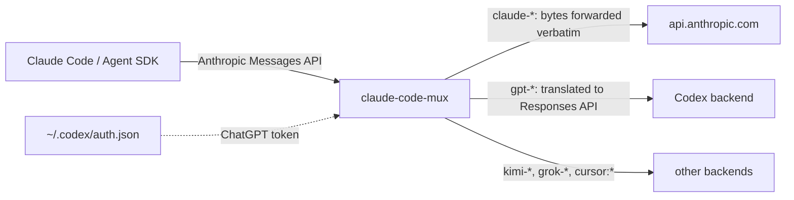

# claude-code-mux

[](https://github.com/null-topology/claude-code-mux/actions/workflows/ci.yml)

Run Claude Code on your **Claude subscription and your ChatGPT (Codex)
subscription at the same time**, and switch between them mid-conversation.

This is a fork of
[fcakyon/claude-code-with-codex](https://github.com/fcakyon/claude-code-with-codex),
itself a fork of
[raine/claude-code-proxy](https://github.com/raine/claude-code-proxy). See
[Credits](#credits) for what each layer contributed.


`claude-code-mux` is a small local proxy. Claude Code already speaks the Anthropic
Messages API, so the proxy speaks it too and sends each request where the model
name says:

- A **Claude** model goes to Anthropic untouched, on the login Claude Code
  already has. Nothing is translated, no API key is involved, and the proxy
  stores no Claude credentials.
- A **Codex** model (`gpt-6-astra`, `gpt-5.6-sol`, ...) is translated to the
  OpenAI Responses API and sent on the ChatGPT login of the Codex CLI.

So Opus can stay on your Claude plan for the hard parts while a Codex model
runs the everyday turns on your ChatGPT plan, in one session, with Claude
Code's own usage warnings and limit messages working for both.

[Quickstart](#quickstart) · [Picking a model](#picking-a-model) ·
[Claude Agent SDK](#claude-agent-sdk) · [Rate limits](#rate-limits) ·
[How it works](#how-it-works) · [Configuration](#configuration) ·
[Other backends](#other-backends) · [Limitations](#limitations) ·
[Development](#development)

## What you need

- **Claude Code** 2.1.261 or newer (for the `modelPicker` setting), signed in
  with a Claude Pro or Max plan.
- A **ChatGPT Plus, Pro, or Team** plan and the **Codex CLI** signed in
  (`codex login`).
- **Rust** only if you install from source. The prebuilt binary needs nothing.

## Quickstart

**1. Install `claude-code-mux`.**

Prebuilt binary for macOS and Linux:

```sh
curl -fsSL https://raw.githubusercontent.com/null-topology/claude-code-mux/main/scripts/install.sh | bash
```

Or build from source with Rust:

```sh
cargo install --git https://github.com/null-topology/claude-code-mux --locked
```

**2. Check the Codex login.** The proxy reads the Codex CLI's own credentials
and has no login of its own.

```sh
claude-code-mux codex auth status
```

Run `codex login` if no valid account is found.

**3. Point Claude Code at the proxy** in `~/.claude/settings.json`:

```json
{
  "env": {
    "ANTHROPIC_BASE_URL": "http://127.0.0.1:18765"
  }
}
```

Do **not** set `ANTHROPIC_API_KEY` or `ANTHROPIC_AUTH_TOKEN`. See
[Claude authentication](#claude-authentication) for why.

**4. Start the proxy** and leave it running:

```sh
claude-code-mux serve
```

It listens on `127.0.0.1:18765` and shows a live monitor when run in a
terminal. `claude-code-mux serve --no-monitor` gives a plain server for a service
manager or a background job.

**5. Restart Claude Code** and pick a model:

```text
/model gpt-5.6-sol
/model claude-opus-5
```

## Picking a model

### Model ids

Codex models are addressed by their Codex id, for example `gpt-6-astra`,
`gpt-5.6-sol`, `gpt-5.6-terra`, `gpt-5.6-luna`, or `gpt-5.5`. The proxy does
not keep that list itself: `claude-code-mux models` and `GET /v1/models` ask
the Codex backend which models your ChatGPT login may use and print exactly
that, so a model Codex starts serving is available without a proxy release
(see [Listing models](#listing-models)).

Two suffixes are understood on any id:

- `-fast` (for example `gpt-5.6-sol-fast`) requests Codex's priority service
  tier for that model.
- `[1m]` (for example `gpt-5.6-sol[1m]`) is Claude Code's large-context marker.
  The proxy strips it before talking to Codex.

Claude models keep their normal names: `claude-opus-5`, `claude-sonnet-5`,
`opus`, `sonnet`, and so on. `claude-code-mux models` prints every id the proxy
accepts.

Any of these works with `/model` inside Claude Code, with `--model` on the
command line, and with `ANTHROPIC_MODEL` to fix one model for a whole session.

### Rows in the `/model` picker

Claude Code's `/model` picker lists its built-in Claude models. Codex models
are not in that list, so out of the box you type their ids. To pick them by
arrow key like the built-in rows, add a `modelPicker` block to
`~/.claude/settings.json`:

```json
{
  "modelPicker": {
    "options": [
      {
        "model": "gpt-6-astra",
        "label": "Astra",
        "description": "GPT-6 Astra · Most capable for complex, demanding work",
        "behavesAs": "claude-opus-5"
      },
      {
        "model": "gpt-5.6-sol",
        "label": "Sol",
        "description": "GPT-5.6 Sol · Reliable agentic workhorse for everyday tasks",
        "behavesAs": "claude-sonnet-5"
      },
      {
        "model": "gpt-5.6-terra",
        "label": "Terra",
        "description": "GPT-5.6 Terra · Balanced agentic coding for everyday work",
        "behavesAs": "claude-sonnet-5"
      },
      {
        "model": "gpt-5.6-luna",
        "label": "Luna",
        "description": "GPT-5.6 Luna · Fast and affordable agentic coding",
        "behavesAs": "claude-haiku-4-5"
      },
      {
        "model": "gpt-5.5",
        "label": "GPT-5.5",
        "description": "GPT-5.5 · Proven previous-generation model for coding and general work",
        "behavesAs": "claude-sonnet-5"
      }
    ]
  }
}
```

The rows appear after the built-in lineup. Each field does one thing:

- `model` is sent to the proxy verbatim, so it must be an id from the table
  above.
- `label` and `description` are only what the picker shows.
- `behavesAs` names a Claude model whose client-side defaults (prompt profile,
  context window assumption, effort handling) Claude Code applies to the row.
  Without it Claude Code treats the model as unknown, assumes a 200k window,
  and prints a warning on every start. It does not change the label or the
  id sent.

`modelPicker` is honored from user settings, managed settings, and the
`--settings` flag, not from a project checkout. Setting
`"replaceBuiltInOptions": true` next to `options` hides the built-in lineup and
shows only these rows.

### Why not gateway model discovery

Claude Code can also fetch `/v1/models` from a gateway
(`CLAUDE_CODE_ENABLE_GATEWAY_MODEL_DISCOVERY=1`), and the proxy serves that
endpoint. It is not the recommended path: discovery only runs when
`ANTHROPIC_AUTH_TOKEN`, an API key, or an `apiKeyHelper` is configured, and
any of those moves Claude Code off the subscription path, where the native
rate-limit events stop arriving for every model. `modelPicker` keeps the
subscription path intact.

### Listing models

`GET /v1/models` answers with what each backend can list right now, not with a
list compiled into the proxy. A backend the proxy holds a login for is asked
on every call; today that is Codex, whose backend has a metadata call that
returns the models the logged-in ChatGPT account may use. It spends no
completion quota and still answers while a usage window is spent, so the
listing is checkable under a rate limit.

Every row carries a `provider` field, and a top-level `providers` block says
where each group's rows came from:

```json
{
  "object": "list",
  "data": [
    {"type": "model", "object": "model", "id": "gpt-6-astra", "provider": "codex",
     "display_name": "…", "description": "…", "visibility": "list",
     "supported_in_api": true, "use_responses_lite": true,
     "context_window": 272000, "max_context_window": 872000,
     "default_reasoning_level": "medium",
     "supported_reasoning_levels": [{"effort": "low", "description": "…"}, …],
     "input_modalities": ["text", "image"]},
    {"type": "model", "object": "model", "id": "kimi-for-coding", "provider": "kimi",
     "display_name": "kimi-for-coding (kimi)"}
  ],
  "has_more": false, "first_id": "gpt-6-astra", "last_id": "…",
  "providers": [
    {"provider": "anthropic", "auth": "client", "source": "none", "status": "not_listed",
     "detail": "credentials are forwarded from the client; models are routed, not listed",
     "fetched_at": null},
    {"provider": "codex", "auth": "proxy", "source": "upstream", "status": "ok",
     "detail": null, "fetched_at": "2026-09-11T10:00:00Z"},
    {"provider": "kimi", "auth": "proxy", "source": "bundled", "status": "ok", …}
  ]
}
```

- `auth` is `proxy` when the proxy stores the login, `client` when the caller
  sends its own credential on every request (the Anthropic passthrough).
- `source` is `upstream` when the backend answered, `bundled` when the rows
  are a list compiled into this build and nothing was verified (kimi, grok,
  cursor), `none` when no rows are produced.
- `status` is `ok`, `unauthorized` (no login on this machine, or the backend
  refused it), `unreachable` (transport error, timeout, 5xx), or `not_listed`.

Codex rows are the backend's own entries, hidden models included; the fields
above are forwarded as the backend sent them, so a consumer decides what to
show. Anthropic is described but has no rows: the proxy holds no Anthropic
credential and Claude Code already lists its own models. No id in `data`
contains `claude` or `anthropic`, which is what keeps Claude Code's gateway
discovery from turning a marker into a picker row.

`GET /v1/models?provider=codex` asks one backend only. When that backend cannot
list, the request fails with 502 and the reason, so a consumer never mistakes
an empty answer for "no models". Without the filter the answer is always 200
and the failure is in the `providers` block.

A model the backend listed routes to codex from then on, `-fast` variant
included, even if this build did not know it. Nothing is cached across
restarts: every call is a fresh answer from the backend.

The listing call requires a `client_version` query parameter. The proxy sends
the version recorded in the Codex CLI's `~/.codex/models_cache.json` when that
file exists next to `auth.json`, else a compiled-in default;
`CCP_CODEX_CLIENT_VERSION` (or `codex.clientVersion` in `config.json`)
overrides both.

## Claude Agent SDK

The SDK drives the same Claude Code binary, so the proxy works there without
changes. Point it at the proxy and name a model:

```python
from claude_agent_sdk import ClaudeAgentOptions, query

options = ClaudeAgentOptions(
    model="gpt-5.6-sol",
    env={"ANTHROPIC_BASE_URL": "http://127.0.0.1:18765", "ANTHROPIC_API_KEY": ""},
)

async for message in query(prompt="Summarize this repository.", options=options):
    print(message)
```

Blank `ANTHROPIC_API_KEY` in the `env` if the surrounding environment carries
one. With a non-empty key the SDK takes the API-billing path and the
`RateLimitEvent` described below is never emitted. Authentication stays the
same as for the terminal: the Claude Code login on the machine, or
`CLAUDE_CODE_OAUTH_TOKEN` in the environment.

## Rate limits

Codex reports its quota inside the stream, and the proxy translates it into the
`anthropic-ratelimit-unified-*` headers Claude Code already reads. The effect
is that Codex models behave like a Claude subscription:

- **Healthy window.** The 5-hour and 7-day utilization arrive on every
  response. Claude Code's usage warning works, and an SDK caller receives a
  `RateLimitEvent` with `status='allowed'` or `'allowed_warning'` and the
  utilization figures.
- **Spent window.** Codex refuses with `usage_limit_reached` and a reset time.
  The proxy answers once, without retrying, with `status='rejected'` and the
  reset time. Claude Code shows its own
  "You've hit your session limit · resets 1:07pm" message and an SDK caller
  gets `RateLimitEvent` with `resets_at`. Before this the proxy burned every
  retry first and the client saw a bare 429 minutes later.

`Retry-After` is deliberately not sent: clients sleep for its full value, and
here that value is hours.

## How it works



- **Routing** is by model name only. `claude-*` ids and the `opus`, `sonnet`,
  `haiku`, `fable` aliases go to Anthropic. Any other id must match a backend's
  catalog exactly; an unknown id returns a 400 that lists the accepted ids.
- **The Claude route is a byte-exact passthrough.** The proxy forwards the
  request body and headers as received, including whatever authorization
  Claude Code attached, and streams the reply back. Because the bytes are
  unchanged, Anthropic's prompt caching keeps working.
- **The Codex route** maps the Messages API onto the Responses API over a
  WebSocket per conversation, keeps `previous_response_id` state per Claude
  Code session and subagent, and reads the ChatGPT login from the Codex CLI's
  `~/.codex/auth.json`. When the token is refreshed it is written back so the
  Codex CLI keeps working.
- **Reasoning survives a switch.** A `thinking` block produced by one backend
  cannot be replayed to the other natively, so the proxy rewrites it as tagged
  text before sending the history on. Context is not lost when you move a
  conversation from one plan to the other.

## Configuration

### Claude Code side

Only `ANTHROPIC_BASE_URL` is required. Restart Claude Code after changing it.

| Variable | What it does |
| --- | --- |
| `ANTHROPIC_BASE_URL` | Point Claude Code at the proxy, e.g. `http://127.0.0.1:18765`. |
| `ANTHROPIC_MODEL` | Force one model for the whole session. |
| `ANTHROPIC_DEFAULT_OPUS_MODEL`, `..._SONNET_MODEL`, `..._HAIKU_MODEL` | Remap a built-in picker row, e.g. `ANTHROPIC_DEFAULT_SONNET_MODEL=gpt-5.6-terra` sends the Sonnet slot to Codex. |
| `CLAUDE_CODE_OAUTH_TOKEN` | Claude login for environments without an interactive `claude login`. Passed through to Anthropic unchanged. |
| `ENABLE_TOOL_SEARCH` | Claude Code disables lazy tool loading behind a non-Anthropic base URL. Set to `true`: the proxy forwards the tool references, and requests shrink considerably. |
| `_CLAUDE_CODE_ASSUME_FIRST_PARTY_BASE_URL` | Behind a non-Anthropic base URL Claude Code budgets every Claude model at 200k tokens, even the ones its catalog marks as native 1M, and auto-compacts against that. Set to `1`: the passthrough is byte-exact, so the built-in rows keep their 1M window through the proxy. |

Context window for Codex rows: Claude Code assumes 200k for a model id it does
not know. Append `[1m]` to the id in a `modelPicker` row (`gpt-6-astra[1m]`)
and Claude Code budgets 1M; the proxy strips the suffix before talking to
Codex. What the Codex backend actually enforces is in `/v1/models`
(`context_window`, `max_context_window` per model), and a request past it is
answered with a context-overflow error that the proxy turns into a compaction
request.

### Claude authentication

The Claude route relies on Claude Code sending its subscription login. That
only happens when no explicit key is configured:

| set on the client | Claude route | rate-limit events |
| --- | --- | --- |
| nothing, or `CLAUDE_CODE_OAUTH_TOKEN` | works on the subscription | delivered for Claude and Codex |
| `ANTHROPIC_API_KEY` | 401 unless the key is a real API key, then API billing | not delivered |
| `ANTHROPIC_AUTH_TOKEN` | works if it holds the OAuth token | not delivered, claude.ai connectors disabled |

The proxy never inspects or replaces the authorization it receives on the
Claude route.

### Proxy side

Settings are read from `CCP_*` environment variables first, then from
`config.json` in the config directory, then defaults. The config directory is
`~/.config/claude-code-proxy` (`CCP_CONFIG_DIR` overrides it); logs, traffic
captures, and error dumps go to `~/.local/state/claude-code-proxy`.

| Variable | Default | What it does |
| --- | --- | --- |
| `PORT` | `18765` | Listening port. `claude-code-mux serve --port N` overrides it. |
| `CCP_BIND_ADDRESS` | `127.0.0.1` | Listening address. |
| `CCP_CODEX_AUTH_FILE` | `~/.codex/auth.json` | Where the Codex CLI keeps its login. |
| `CCP_CODEX_CLIENT_VERSION` | from `~/.codex/models_cache.json`, else built-in | `client_version` sent on the Codex model listing call. |
| `CCP_CODEX_TRANSPORT` | `websocket` | `websocket`, `http`, or `auto`. |
| `CCP_CODEX_EFFORT` | unset | Reasoning effort sent to Codex, e.g. `high`. |
| `CCP_CODEX_SERVICE_TIER` | unset | Service tier for every Codex request. `-fast` ids request `priority` per call. |
| `CCP_CODEX_REASONING_SUMMARY` | unset | Reasoning summary mode requested from Codex, e.g. `auto`. |
| `CCP_CODEX_MODEL` | unset | Send this Codex model regardless of what the client asked for. |
| `CCP_CODEX_QUOTA_WARN_AT` | `0.9` session, `0.75` weekly | Utilization above which a window is reported as past its warning threshold. One value lowers both. |
| `CCP_CODEX_SERVER_COMPACTION` | off | Let Codex compact long histories server-side. |
| `CCP_CODEX_RESPONSES_API` | off | Also expose `/v1/responses` and `/v1/chat/completions` for OpenAI-style clients. |
| `CCP_AUTO_REVIEW_MODEL` | `gpt-5.6-luna` | Model for Claude Code's background security classifier when the session runs on Codex. |
| `CCP_ALIAS_PROVIDER` | `anthropic` | Backend for the Claude aliases. Leave it alone unless you want `opus` to stop meaning Claude. |
| `CCP_LOG_VERBOSE` | off | Keep full string fields in `proxy.log`. |
| `CCP_TRAFFIC_LOG` | off | Capture every request and event under the state directory. Contains prompts and file contents; delete after use. |

### Commands

| Command | What it does |
| --- | --- |
| `claude-code-mux serve [--port N] [--no-monitor]` | Run the proxy. Default command. |
| `claude-code-mux models [--full]` | List model ids per backend: what Codex lists for your login right now, the bundled lists for the others. |
| `claude-code-mux codex auth status` | Show the Codex CLI login the proxy will use. |
| `claude-code-mux kimi\|grok\|cursor auth login\|status\|logout` | Manage the other backends' logins. |
| `claude-code-mux --version` | Print the version. |

## Other backends

The same proxy also routes to **Kimi**, **Grok**, and **Cursor** models, each
with its own login. Run `claude-code-mux models` for their ids and
`claude-code-mux <backend> auth status` to check a login. These backends keep the
behavior of the upstream project this is based on.

## Limitations

- Switching plans in the middle of an active tool call (for example pressing
  Esc during a tool use, then switching and continuing) can fail, because the
  next model cannot verify reasoning that came from the other plan. Starting
  the next step fresh avoids it.
- Codex rate limits are handled on the WebSocket transport, which is the
  default. The HTTP transport still retries a spent window.
- Codex models are not in Claude Code's built-in catalog, so without a
  `modelPicker` row Claude Code assumes a 200k context window for them.

## Development

```sh
cargo build
cargo test -- --test-threads=1        # some config tests share process env
cargo fmt --all -- --check
cargo clippy --all-targets -- -D warnings
cargo run -- serve --no-monitor --port 19000
scripts/debug-proxy                   # isolated instance with traffic capture
```

`just check` runs the same checks through `checkle` when both are installed;
CI runs `just check-ci`. Pushing a `vX.Y.Z` tag builds prebuilt binaries for
macOS, Linux, and Windows through `.github/workflows/release.yml`.

Layout: `src/server.rs` is the axum router and request dispatch,
`src/registry.rs` maps model ids to backends, `src/providers/anthropic/` is the
passthrough, `src/providers/codex/` the Responses API translator, and
`src/providers/translate_shared.rs` holds what the translators share, including
the reasoning tags.

## Credits

Built on [`raine/claude-code-proxy`](https://github.com/raine/claude-code-proxy),
which provides the Codex, Kimi, Grok, and Cursor backends, and on
[`fcakyon/claude-code-with-codex`](https://github.com/fcakyon/claude-code-with-codex),
which added the Claude subscription passthrough, reasoning that survives a
mid-conversation switch, and reading the Codex login from the Codex CLI. This
fork adds Codex rate limits reported the way Claude Code expects, the curated
Codex catalog, and the picker setup above.
